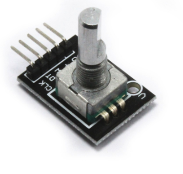

# HEAT-PI-CONTROL
## Python-based Raspberry Pi thermostat application for home automation.

### Install fonts
Copy the setup/thermoFonts repo to the /usr/share/fonts/¡. You can use the follow command in the setup folder:  
`$ sudo cp -r thermoFonts/ /usr/share/fonts`

And the follow is needed to load in memory without restart:   
`$ sudo fc-cache -f -v`

### Install libraries
Install tk libraries:  
`$ sudo apt-get install python3-tk`

Install pip3 with:  
`$ sudo apt-get install python3-pip`

The rest of app dependencies:  
`$ pip3 install -r requirements.txt`

### Start application
To start de application in test mode use the follow command on the project path :
`$ python3 -m heatPicontrol test`

## Prototipage mockup

### Basic Sketch

## Final installation

### Hardware Components

| Picture | Component | Functionality | Price | Purchase Link |
|------|-----------------------------------|--------------------|-------|------------------------------------------|
|| Tenstar Robot  HLK-PM01 | Power Suply x 3    | 7€    | [Link Amazon.es](https://www.amazon.es/gp/product/B07C53B1GZ/ref=ppx_yo_dt_b_asin_title_o04_s00?ie=UTF8&psc=1)|
|| DHT 22 AM2302                     | Temperature Sensor | 2.33€ - 9.50€  | [Link Amazon.es](https://www.amazon.es/gp/product/B06XF4TNT9/ref=ppx_yo_dt_b_asin_title_o08_s00?ie=UTF8&psc=1)|
|| CESFONJERSPDT Interruptor Rockers | Switch x 10            | 5.99€    | [Link Amazon.es](https://www.amazon.es/gp/product/B07QL1LR16/ref=ppx_yo_dt_b_asin_title_o06_s00?ie=UTF8&psc=1)|
|| Raspberry Pi 3 Model B            | Mother Board       | 32.54€ - 37.44€ | [Link Amazon.es](https://www.amazon.es/Raspberry-Pi-Modelo-Quad-Core-Cortex-A53/dp/B01CD5VC92/ref=sr_1_7?__mk_es_ES=%C3%85M%C3%85%C5%BD%C3%95%C3%91&keywords=raspberry&qid=1583358548&sr=8-7) |
|| KY-040                            | Rotary Encoder x 3     | 0.46€ - 5.99€    | [Link Amazon.es](https://www.amazon.es/gp/product/B079H3C98M/ref=ppx_yo_dt_b_asin_title_o07_s00?ie=UTF8&psc=1), [Link aliexpress.com](https://es.aliexpress.com/item/32718891419.html?spm=a2g0o.productlist.0.0.29447ad55Dj4Mc&algo_pvid=642baa21-fe6f-4406-b2d8-86316195583d&algo_expid=642baa21-fe6f-4406-b2d8-86316195583d-8&btsid=0b0a182b15834533314053481ec603&ws_ab_test=searchweb0_0,searchweb201602_,searchweb201603_)|
|| KY-019                           | 5V Relay x 3     | 1.20€ - 6.49€    | [Link Amazon.es](https://www.amazon.es/gp/product/B07CNR7K9B/ref=ppx_yo_dt_b_asin_title_o08_s00?ie=UTF8&psc=1)|
|| 3.5 inch 320*480 TFT                           | Screen     | 16,92 - 19€  | [Link Amazon.es](https://www.amazon.es/Raspberry-Pantalla-Pulgadas-Monitor-interfaz/dp/B01CNLYL1C/ref=sr_1_3?__mk_es_ES=%C3%85M%C3%85%C5%BD%C3%95%C3%91&keywords=3.5+raspberry+screen&qid=1583452730&sr=8-3), [Link aliexpress.com](https://es.aliexpress.com/item/4000368574238.html?spm=a2g0o.productlist.0.0.1cd06f71OtWfdQ&algo_pvid=8d349d57-95f5-4222-a9fa-b9924e0f2cfb&algo_expid=8d349d57-95f5-4222-a9fa-b9924e0f2cfb-55&btsid=0b0a182b15834535302046491ec603&ws_ab_test=searchweb0_0,searchweb201602_,searchweb201603_)|
|| Resistor 10.00k| Resistor for Temperature Sensor     | N/A   | N/A|
|| RIBBA                           | White Frame     | 1,50€   | [Link ikea.es](https://www.ikea.com/es/es/p/ribba-marco-blanco-50378410/)|

## Versioning
### version 0.2.1 (Structured version) includes:

* Logs
* Well structured Python project
* GNU liscense
* Homogenic Canvas and code simplicity
* Basic Readme.md
* New package load
* Package structured global variables

### version 0.1.0 (Stable Version) includes:

* graphic interface
* tactile configuration
* Integration with a weather API 
* Temperature and humidity sensor lectures
* History registration
* Daily temperature graph
* minimum api configuration
* Rotate button integration

